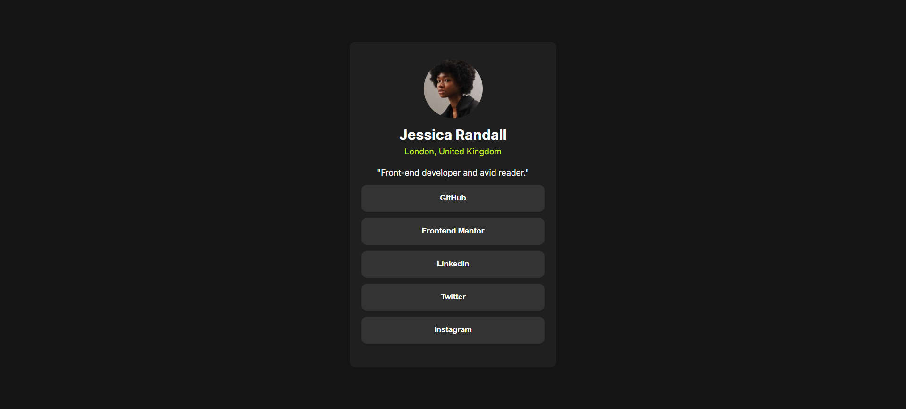

# Frontend Mentor - Social links profile solution

This is a solution to the [Social links profile challenge on Frontend Mentor](https://www.frontendmentor.io/challenges/social-links-profile-UG32l9m6dQ). Frontend Mentor challenges help you improve your coding skills by building realistic projects.

## Table of contents

- [Frontend Mentor - Social links profile solution](#frontend-mentor---social-links-profile-solution)
  - [Table of contents](#table-of-contents)
  - [Overview](#overview)
    - [The challenge](#the-challenge)
    - [Screenshot](#screenshot)
    - [Links](#links)
  - [My process](#my-process)
    - [Built with](#built-with)
    - [What I learned](#what-i-learned)
    - [Continued development](#continued-development)
  - [Author](#author)

## Overview

### The challenge

Users should be able to:

- See hover and focus states for all interactive elements on the page

### Screenshot




### Links

- Solution URL: [Github Repo](https://github.com/rohanpawar680/frontend-mentor-social-links-profile)

## My process

### Built with

- Semantic HTML5 markup
- CSS custom properties
- Flexbox
- CSS Grid
- Mobile-first workflow
- Google Fonts (Inter font family)

### What I learned

I learned how to use CSS custom properties to define a consistent color scheme throughout the project. I also practiced using Flexbox and CSS Grid to create a responsive layout.

```css
:root {
  --green: hsl(75, 94%, 57%);
  --white: hsl(0, 0%, 100%);
  --grey-700: hsl(0, 0%, 20%);
  --grey-800: hsl(0, 0%, 12%);
  --grey-900: hsl(0, 0%, 8%);
}
```

Also I learned how to use CSS properties make it interactive when user focus and hover on button.

```css
button:hover {
  background-color: var(--green);
  color: var(--grey-900);
}

```

### Continued development

I plan to continue practicing responsive design and exploring different layout techniques using CSS Grid and Flexbox. I also plan to learn more about accessibility and how to create more accessible interfaces.

## Author

- Frontend Mentor - [@rohanpawar680](https://www.frontendmentor.io/profile/rohanpawar680)
